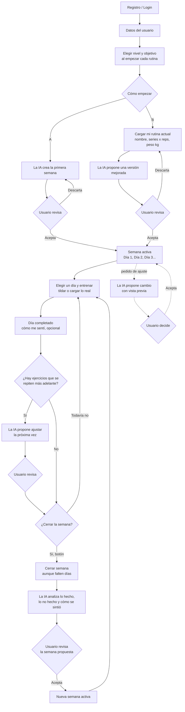

# Flujo de Spotter

Este documento describe cómo se usa la aplicación de principio a fin. Es la base para definir las pantallas, la API y el modelo de datos. Las decisiones de producto reflejadas acá las tomó el usuario; los puntos que todavía no están decididos figuran al final.

## Resumen en pasos

1. El usuario se registra e inicia sesión.
2. Completa sus datos personales.
3. Elige cómo empezar, y **cada vez que empieza una rutina nueva elige su nivel y su objetivo** (obligatorios):
   - **Camino A:** la app crea su primera rutina.
   - **Camino B:** carga la rutina que ya hace y la app se la mejora.
4. La semana se organiza en días: **Día 1, Día 2, Día 3**... El usuario entrena a su ritmo.
5. En cada día **tilda** los ejercicios que hizo como estaban planificados o carga lo que realmente hizo, y termina con **"Día completado"**.
6. Si necesita un cambio durante la semana, se lo pide a la IA, que propone y el usuario decide.
7. Cuando él decide, toca **"Cerrar semana"**: la IA analiza lo planificado frente a lo real y propone la semana siguiente.
8. Vuelve al paso 5.

## Diagrama

## Objetivos

El usuario elige uno **al empezar cada rutina** (no está en el perfil). Sin objetivo y nivel no se genera nada. Al continuar una rutina existente, la semana siguiente hereda los de esa rutina.

| Objetivo | Qué prioriza la IA |
|---|---|
| Ganar masa muscular | Volumen moderado-alto, rangos de repeticiones medios, progresión gradual de carga |
| Ganar fuerza | Cargas altas con pocas repeticiones, ejercicios básicos, descansos largos |
| Perder grasa | **Más cardio y menos fuerza**: la fuerza se mantiene en el mínimo (al menos 2 días por semana) y el resto se completa con cardio. La alimentación queda fuera de la app y se da por hecho que el usuario la maneja |
| Mejorar condición física general | Rutinas equilibradas de cuerpo completo y variedad |
| Mantenerme activo | Rutinas simples y progresión suave |

## Datos del usuario

Se piden una sola vez y se pueden editar después. El nivel y el objetivo no van acá: se eligen al empezar cada rutina. El equipamiento no se pregunta: se da por hecho un gimnasio completo.

**Obligatorios**
- Edad
- Peso corporal (kg)
- Altura (cm)

**Opcionales**
- Sexo (solo para ajustar las cargas iniciales)
- Lesiones o limitaciones (texto libre)

**Aviso legal:** la app no da consejo médico y el usuario debe aceptarlo. No se piden datos de salud más allá de lesiones o limitaciones. El peso corporal se puede actualizar con el tiempo para ver la evolución.

## Camino A: la app crea mi primera rutina

1. El usuario ya completó sus datos y, en el recuadro de "Generar rutina", eligió **continuar una rutina existente** (hereda su nivel y objetivo) o **empezar una nueva** (elige nivel y objetivo; la rutina se crea recién al aceptar). El recuadro tiene un botón **Cancelar**.
2. La IA arma la primera semana (días, ejercicios, series, repeticiones y peso orientativo).
3. El usuario la revisa y la acepta o la descarta para generar otra.

**Si algo sale mal**, el usuario ve un mensaje y puede volver a intentar: falta el perfil o ya hay una semana activa (409), llegó al tope por minuto o por día de la IA (429), la IA no respondió o no pudo armar una rutina válida después de un reintento (502), o la IA no está configurada (503).

**Mientras la IA trabaja:** la llamada a Gemini puede tardar (en las pruebas, de 10 a 90 segundos). El botón "Generar rutina" se deshabilita y la pantalla avisa: *"Tu rutina se está generando. Puede tardar hasta 2 minutos."* Si pasa de 2 minutos la app corta la espera, muestra un error y el usuario puede volver a intentar (la llamada igual cuenta en el tope diario).

## Camino B: cargo la rutina que ya hago

1. El usuario completa un formulario, ejercicio por ejercicio y por día, con:
   - nombre del ejercicio,
   - series × repeticiones,
   - peso en kilos,
   - opcionalmente, indicaciones de ejecución ("bajar lento, pausa arriba").

   Cada ejercicio se puede **desglosar serie por serie** para que cada una tenga sus propias repeticiones y su propio peso (ver "Series desglosables").
2. La IA devuelve una versión mejorada según su objetivo, con el motivo de cada cambio.
3. La rutina original se conserva. El usuario acepta o descarta los cambios.

## La semana y los días

### La semana es un ciclo
La semana no está atada al calendario: empieza cuando el usuario la activa y termina cuando la cierra con el botón. Si tarda más de siete días en completarla, sigue siendo la misma semana. Solo hay una semana activa a la vez, y las semanas anteriores se conservan como historial.

### Cuántos días tiene la semana
Ni los días ni la duración de cada sesión **los elige el usuario**: **los determina la IA** a partir de sus parámetros: el objetivo, el nivel, el volumen que pide la regla del objetivo y, en el camino B, la rutina que cargó. Siempre **entre 2 y 6 días** (al menos 2 por R1, y al menos un día de descanso).

Si el usuario **prefiere entrenar más** (más días o sesiones más largas), puede pedirlo y la IA **recalcula** la semana, con vista previa para aceptar o descartar. Puede pedir **más, nunca menos**. Si después no puede entrenar algún día, no pasa nada: se marca como no hecho y se cuenta como información al cerrar la semana.

### Duración de cada sesión
La IA también determina cuánto dura cada sesión, con una **referencia según el perfil** (una guía, no un tope): principiante y "mantenerme activo" cerca de **60 minutos**; "condición general" **60**; intermedio con masa o fuerza **60 a 90**; "perder grasa" **60 minutos de fuerza más el cardio**. Los principiantes entrenan **2 o 3 días**. Si el volumen lo necesita, o si el usuario pide sesiones más largas, la IA puede pasarse de la referencia.

### Días: "Día 1, Día 2"
Los días se nombran por orden y no por día de la semana (no hay "lunes" ni "martes"). Cada día tiene un título que describe su foco, por ejemplo "Día 1 · Pecho y tríceps". La app puede sugerir el siguiente: el primer día que todavía no se hizo.

## Entrenar un día

### Planificado vs. real
Cada día indica qué toca hacer por ejercicio. Ejemplo:

> Toca press banca **3 × 8 con 50 kg**.

El usuario tiene dos formas de registrarlo, con un solo tilde por ejercicio:

| Lo que hace | Qué queda guardado |
|---|---|
| Tilda el ejercicio sin cambiar nada | Se interpreta que lo hizo tal cual: cada serie con sus repeticiones y su peso planificados |
| Carga lo que realmente hizo (3 × 10 con 40 kg) | Queda lo que escribió y el ejercicio se marca como hecho solo |
| No toca nada | El ejercicio queda como no hecho |

Si se tilda sin cambios, se generan las series reales copiando el plan, así "hecho" siempre significa "tiene series reales". Destildar borra esas series. De la diferencia entre lo planificado y lo real salen el análisis y la reestructuración.

### Series desglosables
Cada ejercicio muestra una **fila compacta** con un solo tilde. Si el usuario la despliega, ve una fila por serie, y cada serie tiene sus propias repeticiones y su propio peso (por ejemplo, una pirámide: 10 × 50, 8 × 55, 6 × 60, 4 × 65).

- **Fila compacta:** si todas las series son iguales, muestra "4 × 10 · 50 kg". Si difieren, muestra un rango ("10 a 4 reps · 50 a 65 kg"). Ese resumen se calcula; no se guarda.
- **El tilde es por ejercicio.** No hay tilde por serie.
- **Qué edita cada cosa durante el día:** si el usuario cambia una serie mientras entrena, registra **lo que hizo**; el plan queda visible como referencia ("tocaba 8 × 55 kg"). Así se conserva la comparación entre lo planificado y lo real. Cambiar el plan en sí es una edición aparte (edición manual).
- **Tilde sin cambios:** se crea una serie real por cada serie planificada, con su propio peso.
- **Indicaciones de ejecución:** cada ejercicio puede mostrar su indicación ("bajar lento, pausa de 2 segundos arriba"). El usuario la escribe o la edita, y la IA puede proponerla al armar o mejorar la rutina. Se muestran como orientativas, no como consejo de un profesional, junto con el aviso legal.

### Descanso y movilidad
- **Descanso:** cada ejercicio muestra el **descanso entre series** sugerido por la IA (por ejemplo, "2 min"). El usuario lo puede cambiar. Es un campo propio del ejercicio, no se calcula.
- **Movilidad y equilibrio:** cada día puede traer un **texto** con la movilidad y el equilibrio del día (por ejemplo, "5 a 10 min de movilidad de cadera"), en dos días por semana. No tiene series ni tilde: es una indicación que el usuario lee y puede editar.

### Cardio
El cardio (cinta, bicicleta, remo, caminata) es **un ejercicio más de la rutina**, pero se mide en **minutos** en vez de series y repeticiones.

- **Fila compacta:** "cinta · 30 min", con el mismo tilde que los demás ejercicios.
- **Tilde sin cambios:** se interpreta que hizo los minutos planificados. Si hizo otros, carga los minutos reales.
- **Intensidad:** se indica en las indicaciones de ejecución ("ritmo moderado, que puedas hablar").
- Se compara lo planificado con lo real igual que en fuerza.

### Isométricos
Un ejercicio isométrico (plancha, sentadilla en pared) es **un ejercicio más de la rutina**, pero se mide en **segundos** por serie, no en repeticiones ni minutos.

- **Fila compacta:** "plancha · 3 × 45 s", con el mismo tilde que los demás ejercicios.
- **Tilde sin cambios:** se interpreta que hizo los segundos planificados. Si hizo otros, carga los segundos reales.
- Cuenta como **fuerza**: suma al día de fuerza y a las series del músculo (la plancha, al core). Lleva descanso entre series como cualquier ejercicio de fuerza.

### Día completado
Al final del día el usuario toca **"Día completado"**:

- La sesión queda cerrada, y se puede reabrir para corregir.
- Los ejercicios sin tildar quedan como no hechos.
- Los datos se guardan a medida que se cargan, no recién al terminar: si se corta la app a mitad del entrenamiento no se pierde nada.
- Un día está completo cuando todos sus ejercicios están hechos, y a medias si solo algunos.
- Es también un cierre con sensación de logro para el usuario: un resumen de lo que hizo y el avance de la semana ("3 de 4 días").

### Cómo me sentí
Al terminar el día, de forma opcional:
- Botones rápidos: fácil, bien, duro, con dolor.
- Un campo de texto libre ("me quedé sin aire en la tercera serie", "me molestó la rodilla").

Se guarda con la sesión y la IA lo lee junto con los números al cerrar la semana, sin llamada extra a Gemini. Si indica dolor, la IA puede bajar la carga o cambiar el ejercicio, pero no da diagnósticos y se muestra el aviso de consultar a un profesional.

### Ejercicios que se repiten en la semana
Si un ejercicio aparece en más de un día (por ejemplo, press banca en el Día 1 y en el Día 3), lo registrado la primera vez también ajusta la segunda. Al completar un día, la app detecta los ejercicios que se repiten más adelante y, si hay alguno, la IA propone el cambio para esa próxima aparición, con vista previa y confirmación. Es una llamada a Gemini por día completado y solo cuando hay ejercicios repetidos.

### Edición manual
Sin pasar por la IA, el usuario puede cambiar las series, las repeticiones y el peso de cada serie, las indicaciones de ejecución, o quitar un ejercicio. Esos cambios quedan marcados y la IA los respeta al armar la semana siguiente.

## La IA propone, el usuario decide

### Ajuste durante la semana
El usuario escribe un pedido dentro de la pantalla de la semana ("no tengo esa máquina", "me molesta el hombro"). Sí puede pedir **entrenar más días**, pero no menos (ver "Cuántos días tiene la semana"). La IA devuelve una **propuesta**, no un cambio directo:

1. Se muestra una vista previa antes y después (qué día, ejercicio o carga cambia y por qué).
2. El usuario acepta o descarta.
3. Solo al aceptar se modifica la semana.

Cada pedido cuenta como una llamada a Gemini.

### Cerrar la semana
El cierre es siempre **manual**, con un botón. Nunca se genera la semana siguiente por fecha: el usuario puede haber descansado o haberse atrasado, y el control es suyo.

1. El usuario toca "Cerrar semana". Puede hacerlo aunque falten días.
2. Los días no hechos se cuentan como no hechos y viajan a la IA como información, junto con lo planificado, lo real, las ediciones manuales y cómo se sintió.
3. La IA muestra un resumen de evolución (qué subió, qué se estancó y dónde hay fatiga) y propone la semana siguiente. Para un día no hecho puede sugerir recuperarlo, repartirlo o dejarlo, siempre como propuesta.
4. El usuario revisa la semana propuesta y la acepta antes de que quede activa. Mientras no cierre la semana, no se genera nada.

Como el cierre es una acción del usuario, el gasto en IA es predecible: una llamada por cierre.

## Pantallas

1. Registro e inicio de sesión
2. Datos del usuario
3. Elegir qué hacer al generar: continuar una rutina o empezar una nueva (nivel y objetivo)
4. Elegir camino A o B
5. Formulario de rutina actual (camino B)
6. Rutina, semana y sus días
7. Día de entrenamiento (tildar o cargar, y "Día completado")
8. Resumen del día y "cómo me sentí"
9. Cierre y resumen de la semana

### Cómo se navega entre las pantallas de la rutina

La **portada** (`/`) tiene los botones **Perfil**, **Mis rutinas** y, solo si no hay una semana activa, **Generar rutina**. Desde ahí se baja por niveles, todo clickeable y con un **botón para volver** al nivel anterior al principio de cada pantalla (también en la vista previa de la propuesta: volver no la descarta, queda pendiente):

| Pantalla | Dirección | Qué muestra |
|---|---|---|
| Mis rutinas | `/rutinas` | Las rutinas, de la más nueva a la más vieja (nombre, objetivo, nivel, cantidad de semanas y si tiene una activa) |
| Rutina | `/rutinas/{id}` | Su nombre, con **Cambiar nombre** (Guardar y Cancelar), y sus semanas, de la más nueva a la más vieja ("Semana 3 · activa", "Semana 2 · cerrada") |
| Semana | `/semanas/{id}` | Sus días ("Día 1 · Torso A", con duración estimada y cantidad de ejercicios) y, si está activa, **Cerrar semana** |
| Día | `/semanas/{id}/dia/{n}` | La movilidad y los ejercicios, con la fila compacta y las series desplegables |

- El **número de semana** es el orden de activación **dentro de su rutina** (la primera de la rutina es la 1). Se calcula, no se guarda.
- **Cerrar semana:** el botón está en la pantalla de la semana activa. Abre un recuadro que nombra los días sin completar ("Te faltan por completar: Día 2, Día 4") y pide confirmar, con **Cancelar**. Cerrar no se puede deshacer ni borra nada; los días sin hacer quedan como información para la IA.
- **Generar:** el botón **Generar rutina** está solo en la portada, cuando no hay semana activa.
- Las **semanas cerradas** se pueden abrir, en lectura.
- **Editar lo realizado, serie por serie** (solo en la semana activa; las cerradas son de lectura). Al desplegar "Ver series", cada serie tiene un botón **Editar**: la fila pasa a dos campos (repeticiones y kilos; segundos en un isométrico, minutos en el cardio) y el botón pasa a **Guardar**, con **Cancelar** al lado. Al guardar, la fila muestra lo que se hizo y, si difiere de lo planificado, "(tocaba 10 reps · 50 kg)". El **plan no cambia**: lo realizado se guarda aparte (`set_entries`, enlazado a la serie con `plan_set_id`) y la primera vez que se guarda algo en un día se crea su sesión (`workout_sessions`). El peso puede quedar vacío; un valor inválido muestra el error en la misma fila.
- Lo realizado se compara con lo planificado (`plan_sets` frente a `set_entries`), sin un campo extra de "editado".
- **Marcar una serie como hecha** (opcional, como control del usuario para no perderse mientras entrena): cada serie tiene un botón **Marcar como hecha**, que guarda lo realizado igual a lo planificado, y **Desmarcar**, que borra lo registrado de esa serie (con confirmación si estaba editada). Editar y guardar una serie también la deja como hecha. Una serie hecha muestra "✓ hecha".
- **Marcar un ejercicio como hecho** (el "tilde" por ejercicio, que en pantalla es el botón **Marcar como hecho**) **lo cierra**: las series que todavía no tienen nada registrado copian lo planificado y las que ya marcaste o editaste se respetan. **No hace falta marcar las series una por una**: las series sin marcar ni editar se cuentan como hechas con lo planificado, las marcadas quedan como estaban y las editadas conservan lo editado (por ejemplo: serie 1 y 2 marcadas, la 3 editada sin marcar y la 4 sin tocar, quedan las cuatro hechas, la 3 con el valor editado).
- **Un ejercicio hecho queda bloqueado:** sus series no se pueden editar, marcar ni desmarcar. Para corregirlo está **Reabrir ejercicio**, que lo desbloquea **sin borrar nada** de lo registrado (igual que "Reabrir día"). **Deshacer** borra lo registrado de ese ejercicio y, si hay series editadas, pide confirmación antes.
- **Marcar todas las series a mano no cierra el ejercicio:** se ve "4 de 4 series hechas" pero el ejercicio sigue abierto hasta que toques Marcar como hecho. El pie del día cuenta solo los ejercicios cerrados ("Hechos: 3 de 6 ejercicios").
- **Día completado:** al pie del día, el botón **Día completado** cierra la sesión (`workout_sessions.finished_at`). Los ejercicios sin registrar quedan como no hechos y se puede completar con ejercicios pendientes. Con el día completado no se puede tildar ni editar nada hasta tocar **Reabrir día**. El pie muestra "Hechos: 3 de 6 ejercicios".
- En la lista de días de la semana, cada día muestra su estado: nada si no se registró nada, "a medias" si hay algo registrado y "✓ completado" si se tocó Día completado.
- Todo esto solo vale en la semana activa; las cerradas son de lectura.
- La fila de un ejercicio es un componente compartido: lo usan la vista previa de la propuesta y la vista del día.

## Puntos abiertos

Resueltos:

- **Dónde van Cerrar semana y Generar:** cerrar en la pantalla de la semana activa (con aviso de los días sin completar, tarea #47) y generar en la portada.
- **Reabrir un día completado:** se puede, con el botón **Reabrir día** (ver "Día completado"). Lo mismo con un ejercicio cerrado: **Reabrir ejercicio**.

Todavía no están decididos:

- **Avisos al usuario.** Se propone, a futuro, algo suave que sugiera sin hacer nada solo (por ejemplo, "completaste todos los días, ¿cerrar la semana?"). Ver las ideas en `docs/backlog.md`.
- **Ajuste de ejercicios repetidos.** ¿Lo hace la IA (una llamada por día completado) o una regla simple sin IA, más barata y predecible?
- **Dónde vive el pedido de ajuste.** Se recomienda una caja de texto dentro de la pantalla de la semana, en lugar de un chat aparte.

## Efectos sobre el modelo de datos

Lo ya aplicado está en `docs/modelo-datos.md`. Resumen de cómo se refleja este flujo:

- `profiles`: edad, peso, altura, sexo (opcional) y limitaciones. Sin nivel, objetivo ni equipamiento.
- `routines`: nombre, objetivo (uno de los 5) y nivel; agrupan las semanas.
- `week_plans`: pertenece a una rutina (`routine_id`); `week_start` es cuándo se activó la semana, `closed_at` cuándo se cerró, y un campo de origen (`generated` o `improved`) con la rutina original en el camino B.
- `plan_days`: `day_index` es el orden (Día 1, Día 2...), no un día del calendario.
- `plan_exercises`: el ejercicio planificado, con `execution_notes` (indicaciones) y un marcador `edited_by_user`.
- `plan_sets`: una fila por serie planificada, con sus repeticiones y su peso.
- `set_entries`: lo real (repeticiones, segundos o minutos, peso en kg y esfuerzo opcional), enlazado a la serie planificada (`plan_set_id`) para comparar serie por serie. Una serie "hecha" es una serie con una fila acá.
- `workout_sessions`: una por día (se crea sola la primera vez que se registra algo), con `finished_at` (se completa con "Día completado" y se vacía con "Reabrir día"), `feeling` (easy, good, hard o pain) y `notes` (todavía sin pantalla: tarea #46).
- `exercise_completions`: qué ejercicios cerró el usuario con "Marcar como hecho" (quedan bloqueados hasta reabrirlos).
- `plan_proposals` y `ai_calls`: propuestas de la IA (`pending`, `accepted` o `discarded`; solo al aceptar se escribe en el plan) y registro de cada llamada para los topes de Gemini. Ya se usan en "Generar rutina".
