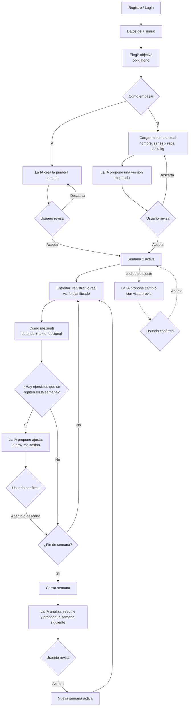

# Flujo de Spotter

Este documento describe cómo se usa la aplicación de principio a fin. Es la base para definir las pantallas, la API y el modelo de datos.

## Resumen en pasos

1. El usuario se registra e inicia sesión.
2. Completa sus datos y **elige su objetivo** (obligatorio).
3. Elige cómo empezar:
   - **Camino A:** la app crea su primera rutina.
   - **Camino B:** carga la rutina que ya hace y la app se la mejora.
4. Entrena y registra lo que realmente hizo, comparado con lo planificado.
5. Si necesita un cambio durante la semana, se lo pide a la IA, que propone y el usuario confirma.
6. Cierra la semana: la IA analiza lo ocurrido y propone la semana siguiente.
7. Vuelve al paso 4.

## Diagrama

## Objetivos

El usuario debe elegir uno. Sin objetivo no se puede avanzar.

| Objetivo | Qué prioriza la IA |
|---|---|
| Ganar masa muscular | Volumen moderado-alto, rangos de repeticiones medios, progresión gradual de carga |
| Ganar fuerza | Cargas altas con pocas repeticiones, ejercicios básicos, descansos largos |
| Perder grasa | Combinar fuerza con más trabajo general, sesiones eficientes, mantener la masa |
| Mejorar condición física general | Rutinas equilibradas de cuerpo completo y variedad |
| Mantenerme activo | Rutinas simples, pocas sesiones y progresión suave |

## Datos del usuario

Se piden una sola vez y se pueden editar después.

**Obligatorios**
- Edad
- Peso corporal (kg)
- Altura (cm)
- Nivel de experiencia: principiante, intermedio o avanzado
- Objetivo (uno de los 5)
- Días por semana que puede entrenar
- Duración aproximada de cada sesión
- Equipamiento: gimnasio completo, mancuernas o en casa

**Opcionales**
- Sexo (solo para ajustar las cargas iniciales)
- Lesiones o limitaciones (texto libre)

**Aviso legal:** la app no da consejo médico y el usuario debe aceptarlo. No se piden datos de salud más allá de lesiones o limitaciones. El peso corporal se puede actualizar con el tiempo para ver la evolución.

## Camino A: la app crea mi primera rutina

1. El usuario ya completó sus datos y su objetivo.
2. La IA arma la primera semana (días, ejercicios, series, repeticiones y peso orientativo).
3. El usuario la revisa y la acepta o la descarta para generar otra.

## Camino B: cargo la rutina que ya hago

1. El usuario completa un formulario, ejercicio por ejercicio y por día, con:
   - nombre del ejercicio,
   - series × repeticiones,
   - peso en kilos.
2. La IA devuelve una versión mejorada según su objetivo, con el motivo de cada cambio.
3. La rutina original se conserva. El usuario acepta o descarta los cambios.

## Ciclo semanal

### Cadencia
La reestructuración completa se hace una vez por semana. Hasta el cierre, la IA no cambia el plan sola: solo propone ajustes y el usuario los acepta. Cada semana queda guardada como un plan propio, así se arma un historial.

### Planificado vs. real
Cada día indica qué toca hacer por ejercicio. Ejemplo:

> Hoy toca press banca **3 × 8 con 50 kg**.

El usuario registra lo que realmente hizo:

> Hice **3 × 10 con 40 kg**.

La app guarda ambos lados y los compara ejercicio por ejercicio: si cumplió, si superó lo planificado o si no llegó, y con más o menos carga. De esa diferencia salen el análisis y la reestructuración.

### Ejercicios que se repiten en la semana
Si un ejercicio aparece en más de un día (por ejemplo, press banca el lunes y el jueves), lo registrado en la primera sesión también ajusta la segunda.

Al terminar una sesión, la app detecta los ejercicios que se repiten más adelante en la semana. Si hay alguno, la IA propone el cambio para esa próxima aparición, con vista previa y confirmación del usuario. Es una llamada a Gemini por sesión y solo cuando hay ejercicios repetidos.

### Cómo me sentí
Al terminar la sesión, de forma opcional:
- Botones rápidos: fácil, bien, duro, con dolor.
- Un campo de texto libre ("me quedé sin aire en la tercera serie", "me molestó la rodilla").

Se guarda con la sesión y la IA lo lee junto con los números al cerrar la semana, sin llamada extra a Gemini. Si indica dolor, la IA puede bajar la carga o cambiar el ejercicio, pero no da diagnósticos y se muestra el aviso de consultar a un profesional. La entrada por voz queda como mejora futura.

### Edición manual
Sin pasar por la IA, el usuario puede cambiar series, repeticiones y peso, o quitar un ejercicio. Esos cambios quedan marcados y la IA los respeta al armar la semana siguiente.

### Ajuste a mitad de semana con IA
El usuario escribe un pedido dentro de la pantalla de la semana ("solo puedo 3 días", "no tengo esa máquina", "me molesta el hombro"). La IA devuelve una **propuesta**, no un cambio directo:

1. Se muestra una vista previa antes y después (qué día, ejercicio o carga cambia y por qué).
2. El usuario acepta o descarta.
3. Solo al aceptar se modifica la semana.

Cada pedido cuenta como una llamada a Gemini.

### Cerrar la semana
1. La IA analiza lo registrado contra lo planificado y los cambios manuales.
2. Muestra un resumen de evolución: qué subió, qué se estancó y dónde hay fatiga.
3. Propone la semana siguiente.
4. El usuario la revisa y la acepta antes de que quede activa.

## Pantallas

1. Registro e inicio de sesión
2. Datos del usuario
3. Elegir objetivo (obligatoria)
4. Elegir camino A o B
5. Formulario de rutina actual (camino B)
6. Semana y día
7. Registro de sesión (con "cómo me sentí")
8. Resumen semanal

## Puntos abiertos

Todavía no están decididos:

- El ajuste de ejercicios repetidos dentro de la semana: ¿lo hace la IA (una llamada por sesión) o una regla simple sin IA, más barata y predecible?
- ¿Cómo se dispara el cierre de semana? Se recomienda un botón "Cerrar semana", en lugar de un cierre automático.
- ¿Dónde vive el pedido de ajuste? Se recomienda una caja de texto dentro de la pantalla de la semana, en lugar de un chat aparte.

## Efectos sobre el modelo de datos

Se anotan acá y se aplican cuando se defina el modelo (issue #10):

- `profiles`: edad, peso, altura, sexo (opcional) y duración de sesión; el objetivo es obligatorio y uno de los 5 valores.
- `week_plans`: campo de origen (`generated` o `improved`) y, en el camino B, la rutina original cargada por el usuario.
- `plan_proposals`: lo que propone la IA (ajuste, cierre semanal o mejora del camino B), con estado `pending`, `accepted` o `discarded`. Solo al aceptar se escribe en `week_plans`.
- `plan_exercises`: lo planificado (series, repeticiones, peso objetivo), con un marcador `edited_by_user`.
- `set_entries`: lo real (series, repeticiones, peso en kg y esfuerzo opcional), enlazado al ejercicio planificado para comparar.
- `workout_sessions`: `feeling` (easy, good, hard o pain) y `notes` (texto libre opcional).
- `ai_calls`: una fila por cada llamada a la IA, para aplicar los topes de uso de Gemini.
