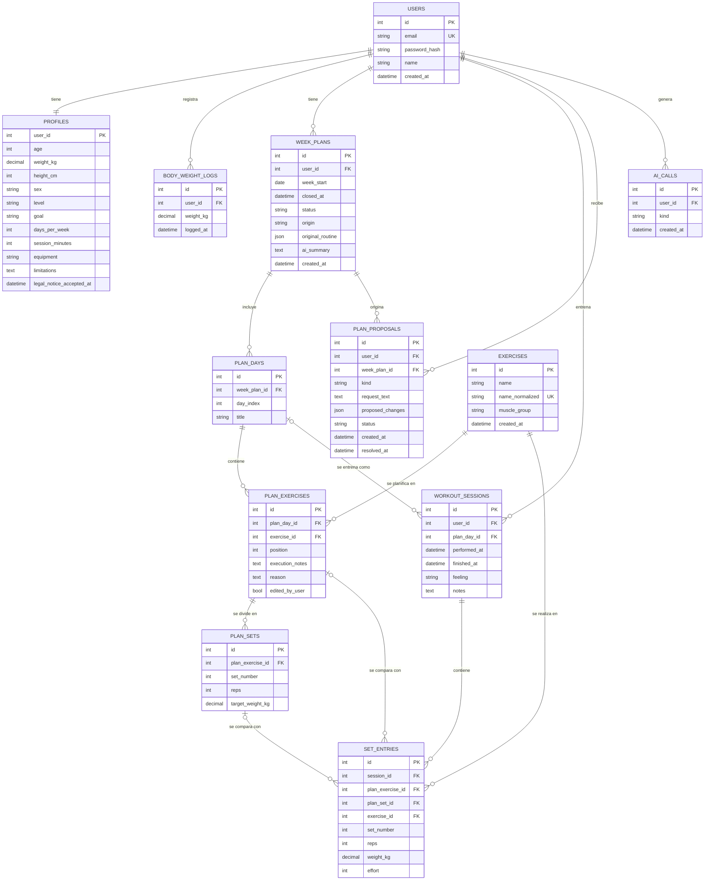

# Modelo de datos de Spotter

Este documento define las tablas de la base de datos (PostgreSQL). Parte del flujo descrito en [`flujo-app.md`](flujo-app.md) y es la base para los modelos de SQLAlchemy y las migraciones de Alembic.

## Estado de implementación

Las migraciones de Alembic crean estas tablas por etapas:

| Migración | Tablas | Estado |
|---|---|---|
| `0001` núcleo | `users`, `profiles`, `exercises`, `week_plans`, `plan_days`, `plan_exercises`, `workout_sessions`, `set_entries` | Implementada |
| `0002` fin de sesión y cierre de semana | Agrega `week_plans.closed_at` y `workout_sessions.finished_at` | Implementada |
| `0003` series planificadas e indicaciones | Crea `plan_sets`; agrega `plan_exercises.execution_notes` y `set_entries.plan_set_id`; quita `sets`, `reps` y `target_weight_kg` de `plan_exercises` | Implementada |
| Semana 4 | `plan_proposals`, `ai_calls` | Pendiente: se agregan cuando se construya la IA |
| Cuando haga falta | `body_weight_logs` | Pendiente |

## Diagrama

## Tablas

### users
Cuenta del usuario.

| Campo | Detalle |
|---|---|
| id | Clave primaria |
| email | Único |
| password_hash | Contraseña con hash, nunca en texto plano |
| name | Nombre |
| created_at | Fecha de alta |

### profiles
Datos del usuario y objetivo. Una fila por usuario.

| Campo | Detalle |
|---|---|
| user_id | Clave primaria y foránea a `users` |
| age, weight_kg, height_cm | Edad, peso corporal y altura |
| sex | Opcional; solo para ajustar cargas iniciales |
| level | `principiante`, `intermedio` o `avanzado` |
| goal | **Obligatorio.** `masa`, `fuerza`, `perder_grasa`, `condicion_general` o `mantenerme_activo` |
| days_per_week, session_minutes | Días disponibles y duración de cada sesión |
| equipment | `gimnasio`, `mancuernas` o `casa` |
| limitations | Lesiones o limitaciones (texto opcional) |
| legal_notice_accepted_at | Cuándo aceptó el aviso legal |

### body_weight_logs
Historial del peso corporal, para ver la evolución. Cuando el usuario actualiza su peso se agrega una fila y se actualiza `profiles.weight_kg`.

### exercises
Ejercicios conocidos por la app. **No hay catálogo precargado**: la tabla crece sola.

| Campo | Detalle |
|---|---|
| name | Nombre tal como lo escribió la IA o el usuario |
| name_normalized | **Único.** Minúsculas y sin tildes, para evitar duplicados |
| muscle_group | Opcional; lo propone la IA |

### week_plans
Un plan por semana. Las semanas anteriores se conservan como historial. La semana se cierra **a mano**, con un botón; nunca se genera sola por fecha.

| Campo | Detalle |
|---|---|
| week_start | Cuándo el usuario activó la semana. No tiene que ser un lunes: la semana es un ciclo |
| closed_at | Cuándo el usuario la cerró con el botón. Vacío mientras sigue abierta |
| status | `draft`, `active` o `closed` |
| origin | `generated` (camino A) o `improved` (camino B) |
| original_routine | JSON con la rutina que cargó el usuario; solo en el camino B |
| ai_summary | Resumen de evolución que genera la IA al cerrar la semana |

### plan_days
Días de entrenamiento de una semana. `day_index` va de 1 a 7 y es el **orden** dentro de la semana ("Día 1", "Día 2"...), no un día del calendario. `title` describe el foco del día (por ejemplo, "Pecho y tríceps").

### plan_exercises
Lo **planificado**: qué ejercicio toca hacer en cada día. Las series, repeticiones y pesos no están acá: están en `plan_sets`.

| Campo | Detalle |
|---|---|
| position | Orden dentro del día |
| execution_notes | Indicaciones de ejecución propias de esta rutina (ritmo, pausas, técnica), por ejemplo "bajar lento, pausa de 2 segundos arriba". Opcional |
| reason | Explicación de la IA ("¿por qué esto?") |
| edited_by_user | `true` si el usuario cambió el ejercicio o alguna de sus series a mano; la IA lo respeta |

### plan_sets
Una fila por **serie planificada**. Permite que cada serie tenga sus propias repeticiones y su propio peso (por ejemplo 10 × 50, 8 × 55, 6 × 60, 4 × 65).

| Campo | Detalle |
|---|---|
| plan_exercise_id | Ejercicio planificado al que pertenece (se borra en cascada) |
| set_number | Número de serie. **Único** dentro de cada ejercicio |
| reps | Repeticiones planificadas |
| target_weight_kg | Peso planificado en kilos. Vacío en ejercicios con peso corporal |

El resumen "4 × 10 con 50 kg" **se calcula** a partir de estas filas, no se guarda: si las series son iguales se muestra así, y si difieren se muestra un rango ("10 a 4 reps · 50 a 65 kg").

### workout_sessions
Una sesión de entrenamiento realizada.

| Campo | Detalle |
|---|---|
| plan_day_id | Día del plan que se entrenó (opcional) |
| performed_at | Cuándo se empezó |
| finished_at | Cuándo el usuario tocó "Día completado". Vacío mientras la sesión está en curso; volver a dejarlo vacío la reabre |
| feeling | `easy`, `good`, `hard` o `pain` |
| notes | Texto libre opcional ("cómo me sentí") |

### set_entries
Lo **real**: cada serie que el usuario hizo.

| Campo | Detalle |
|---|---|
| plan_exercise_id | Ejercicio planificado al que corresponde (opcional) |
| plan_set_id | Serie planificada con la que se compara. Vacío en las series extra que no estaban en el plan |
| exercise_id | Ejercicio realizado |
| set_number, reps, weight_kg | Número de serie, repeticiones y peso en kilos |
| effort | Esfuerzo de 1 a 10 (opcional) |

### plan_proposals
Lo que propone la IA antes de aplicarse.

| Campo | Detalle |
|---|---|
| kind | `adjust`, `week_close`, `improve` o `repeat_exercise` |
| request_text | Pedido del usuario, si lo hubo ("solo puedo 3 días") |
| proposed_changes | JSON con los cambios, validado con Pydantic |
| status | `pending`, `accepted` o `discarded` |
| resolved_at | Cuándo el usuario aceptó o descartó |

### ai_calls
Una fila por cada llamada a Gemini. Los topes diario y por minuto se calculan contando estas filas.

## Decisiones de diseño

1. **Los ejercicios crecen solos.** La IA elige libremente los ejercicios. Al guardar un plan se busca el ejercicio por `name_normalized`; si no existe, se crea. Así "Press banca" y "press de banca" son el mismo ejercicio y el historial queda comparable.
2. **Planificado y real van separados.** `plan_exercises` guarda lo que toca y `set_entries` lo que se hizo. Esa diferencia es la base del análisis semanal.
3. **La IA propone y el usuario decide.** Los cambios se guardan primero en `plan_proposals` con estado `pending` y solo se escriben en `week_plans` cuando el usuario acepta.
4. **`ai_calls` no se borra.** Igual que el tope diario de Gemini, depende de contar filas; borrarlas permitiría saltearse el límite. Por eso no hay endpoint para eliminarlas.
5. **Historial de semanas.** Cada semana es un `week_plan` propio con su estado; al cerrarla pasa a `closed` y se conserva.
6. **Ediciones manuales respetadas.** `edited_by_user` evita que la IA pise los cambios que hizo el usuario al armar la semana siguiente.
7. **La semana es un ciclo que el usuario cierra.** `closed_at` queda vacío hasta que el usuario toca "Cerrar semana". Se puede cerrar con días sin hacer: esos días se cuentan como no hechos y viajan a la IA como información.
8. **Los días se llaman Día 1, Día 2.** `day_index` es un orden, no un día de la semana, así que la semana se puede correr sin que nada se rompa.
9. **La sesión se cierra con un botón.** `finished_at` distingue una sesión en curso de una terminada, y permite reabrirla. Los datos se guardan a medida que se cargan, no recién al terminar.
10. **Las series se guardan una por una.** `plan_sets` tiene una fila por serie planificada, así cada serie puede tener sus propias repeticiones y su propio peso, y se compara serie por serie con lo realizado (`set_entries.plan_set_id`). Con una sola fuente de verdad no hay dos lugares que puedan contradecirse.
11. **Las indicaciones de ejecución son de la rutina.** `execution_notes` vive en el ejercicio planificado, no en el ejercicio general: el usuario la escribe o la edita, y la IA puede proponerla.
